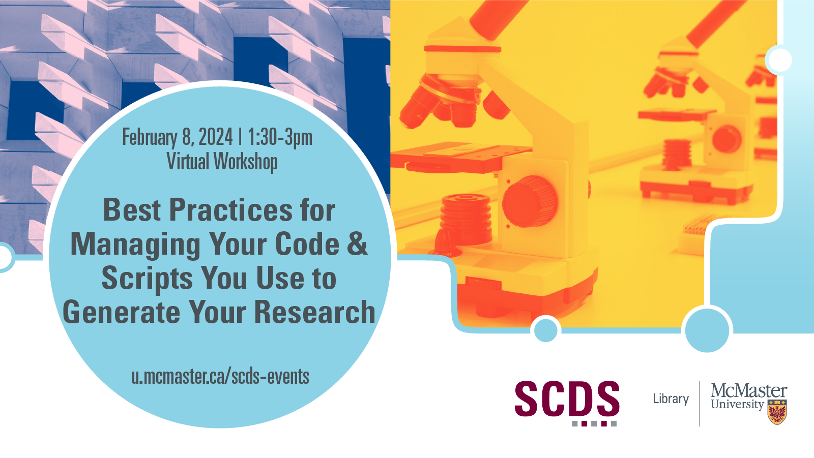

# Best Practices for Managing Your Code and Scripts You Use to Generate Your Research

Preservation of software with your research data is an important part of open research and will be a future requirement by the Tri-agencies for Data Deposit. In this introductory session, learn how you can apply research data management practices and FAIR data principles to software, and some best practices that will help you prepare for depositing the custom code and analysis scripts you use to generate and process your research data, and how these practices can help you now in developing and maintaining this work.

<!-- [Register for this workshop](https://libcal.mcmaster.ca/event/3738761){: .btn .btn-outline } -->

## Workshop Preparation

This workshop is suited for researchers and research teams, including graduate students and post-doctoral fellows, with basic experience in working with data and/or custom code and analysis scripts.

## Facilitator Bios

This workshop is co-hosted by two groups: the Research Software Development Team and Research Data Management Services. The [Research Software Development (RSD) team](https://research.mcmaster.ca/home/support-for-researchers/research-resources/research-software-development/), a component team of the Digital Resarch Commons Pilot (DRCP). This group supports software development by researchers and research groups by developing public resources, hosting training sessions, and providing consultations.

[Research Data Management](https://library.mcmaster.ca/services/rdm) is a team of RDM Specialists Danica Evering and Isaac Pratt. RDM Services support the active organization and maintenance of data throughout its lifecycle--from collection to interpretation, dissemination, long-term preservation, and reuse. The application of RDM best practices improves research efficiency, enables verification of research results, and fosters innovative and interdisciplinary research through data reuse.

## Workshop Recording

<iframe height="416" width="100%" allowfullscreen frameborder=0 src="https://echo360.ca/media/7a90f207-ac1b-41a0-825d-a5bbe9694e27/public"></iframe>
[View original here.](https://echo360.ca/media/7a90f207-ac1b-41a0-825d-a5bbe9694e27/public)

## Workshop Slides

<embed src="assets/docs/reproducible_research_slides.pdf" style="border:none;" width="100%" height="466px">

[Download as PDF.](assets/docs/reproducible_research_slides.pdf)
