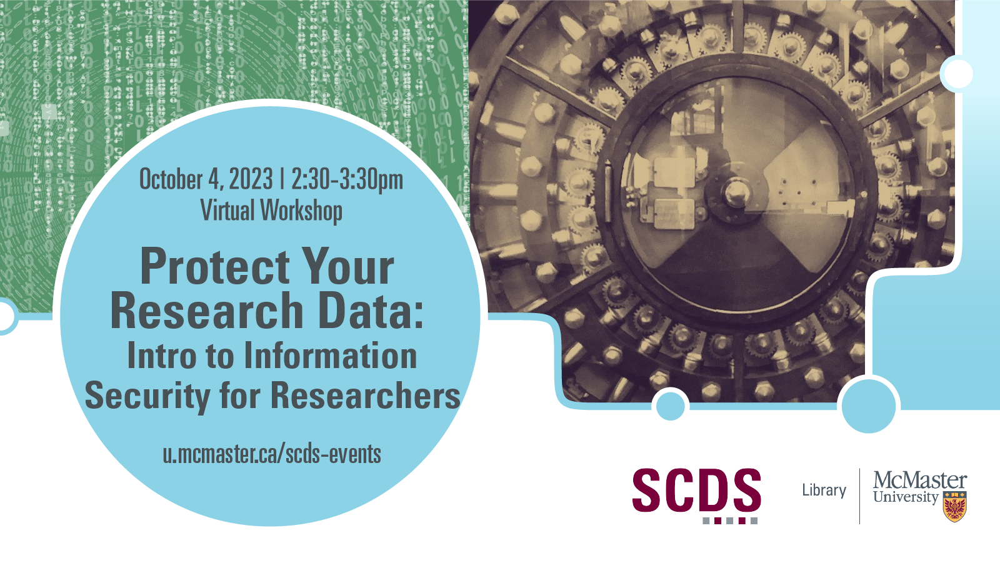

# Protect Your Research Data: Introduction to Information Security for Researchers

Universities are not immune from data breaches and cyber attacks. Learn to protect your research data at this webinar with McMaster experts in IT Security and Cybersecurity. After introducing Information Security (a field dedicated to protecting sensitive digital information and data from unauthorized access, alteration, and/or destruction), the session will examine InfoSec problems specific to researchers. This webinar will also include a case study: If we take a hypothetical research workplace (such as a lab or office), what are its potential Information Security weak spots and how might we fix them?

## Event Recording

<iframe height="416" width="100%" allowfullscreen frameborder=0 src="https://echo360.ca/media/dd59fff0-78e8-4082-8f5e-e9aded4c5a11/public"></iframe>
[View original here.](https://echo360.ca/media/dd59fff0-78e8-4082-8f5e-e9aded4c5a11/public)

## Facilitator Bios

Greg Atkinson is Senior Manager of Information Technology at McMaster University. 

Miroslav Cika is Research and IT Security Analyst, part of Information Security Services in UTS, McMaster University. Electrical Technologist with background in DIY electronics, computer science, history, economics, and log cabin building.