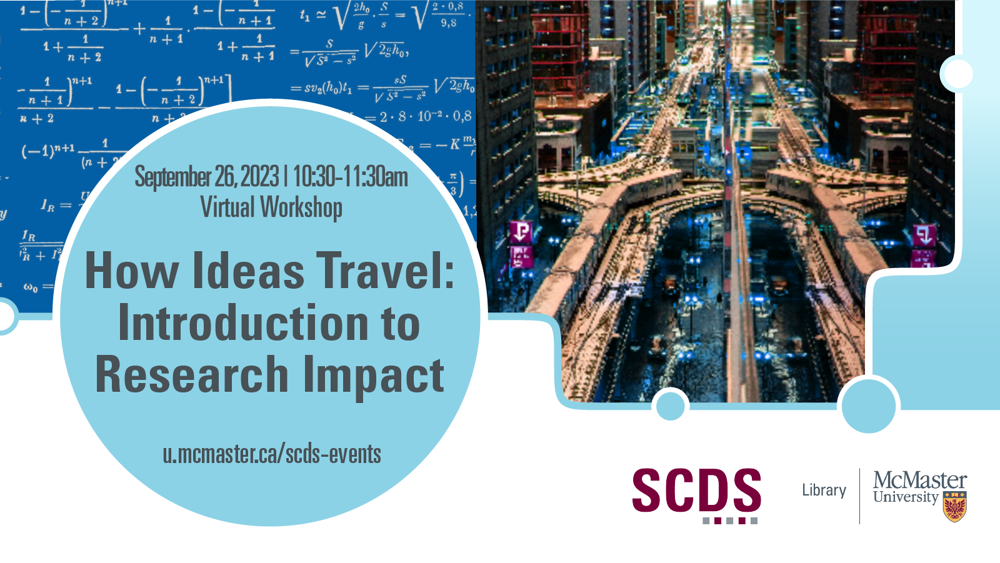

# How Ideas Travel: Introduction to Research Impact

This virtual session introduces attendees to the world of Research Impact. Research impact counts the number of times a publication has been cited by other researchers or mentioned in media. Understanding the field can help you identify "hot topics" of emerging research, gain a more thorough grasp of your research community, benchmark your career progress, communicate your knowledge more effectively, and more. Learn to leverage key databases to identify the expertise of researchers, institutions, and journals at this introductory workshop!

## Facilitator Bios

Jeffrey Demaine is McMaster University Library's Bibliometrics and Research Impact Librarian. He worked for a dozen years at the National Research Council, as a researcher in a German think-tank, and as the Bibliometrics librarian at the University of Waterloo. His recent publications reveal forgotten “Sleeping Beauty” articles, the changing gender distribution of Canadian researchers, and the effect of increased collaborations on the research impact of universities around the world. Beyond simply counting citations, Jeffrey parses the metadata of academic publications, examines the changing structure of science, and reveals the patterns that underly the work of McMaster’s researchers. He also co-organizes a [Canadian conference on Bibliometrics](https://www.bric-conference.ca/).

Jack Young (he/him) is Health Sciences Librarian at McMaster University. His primary area of focus is bibliometrics and research impact assessment, where he supports the reporting and strategic planning needs of academic departments, research groups, and individual researchers. Jack is particularly interested in the unique applications of bibliometrics for strategic decision making and believes a responsible and holistic understanding of research impact is a prerequisite for achieving research excellence.

## Workshop Recording

<iframe height="416" width="100%" allowfullscreen frameborder=0 src="https://echo360.ca/media/8d23333d-84e9-42ba-8d5a-3696a66e1279/public"></iframe>
[View original here.](https://echo360.ca/media/8d23333d-84e9-42ba-8d5a-3696a66e1279/public)

## Links and Resources

To learn more about research impact at McMaster, visit <https://library.mcmaster.ca/services/research-impact>.  

If you have any questions about research impact, or the use of bibliometrics, feel free to send us an email at [impact@mcmaster.ca](mailto:impact@mcmaster.ca).

- [Dimensions](https://library.mcmaster.ca/databases/dimensions-analytics-digital-science) (requires a McMaster login)
- [Altmetric](https://library.mcmaster.ca/databases/altmetric-explorer) (requires a McMaster login)
- [Web of Science](https://library.mcmaster.ca/databases/isi-web-knowledge) (requires a McMaster login)
- [VoS Viewer](https://www.vosviewer.com/)
- [Research Rabbit](https://researchrabbitapp.com/)
- [LitMaps](https://www.litmaps.com/)