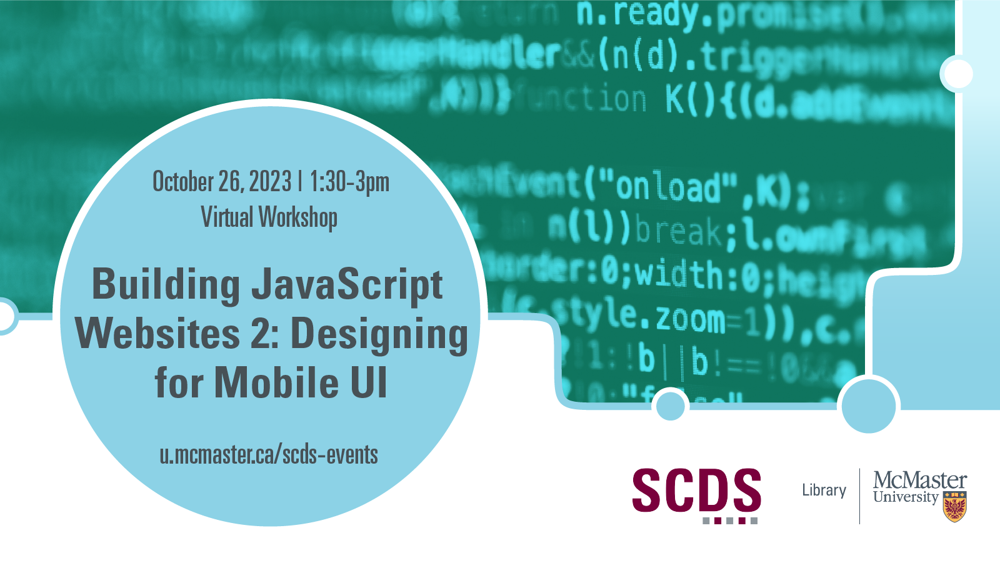

# Building JavaScript Websites 2: Designing for Mobile UI

Are you building your own web site using JavaScript and frameworks? In this second workshop of the Building JavaScript Websites series, learn to design your web site to work for desktop and mobile sized screens.

Starting from a simple prepared single-page application, we will walk you through how to scale your web site to work with the small screens on mobile devices without any loss of functionality. Each workshop in this series can be taken independently of the other workshops in the series.

**The materials for this workshop are available here:** <https://mcmasterrs.github.io/ws_web-design-guide/>

## Workshop Preparation

This workshop is for beginner web developers with some JavaScript experience and their own web development environment. Participants will need to set up React.js and frameworks in their own development environment. Follow the [workshop setup guide](https://mcmasterrs.github.io/ws_web-design-guide/pre-workshop.html), or come to the [optional preparation session from 12:30-1:30pm](https://libcal.mcmaster.ca/event/3740450) to troubleshoot any issues. We make it easy! All sessions in this series use the same setup.

## Facilitator Bio

This workshop is hosted by the [Research Software Development (RSD) team](https://research.mcmaster.ca/home/support-for-researchers/research-resources/research-software-development/), a component team of the [Digital Research Commons Pilot (DRCP)](https://research.mcmaster.ca/home/support-for-researchers/research-resources/digital-research-commons-pilot-drcp/). This group supports software development by researchers and research groups by developing public resources, hosting training sessions, and providing consultations.