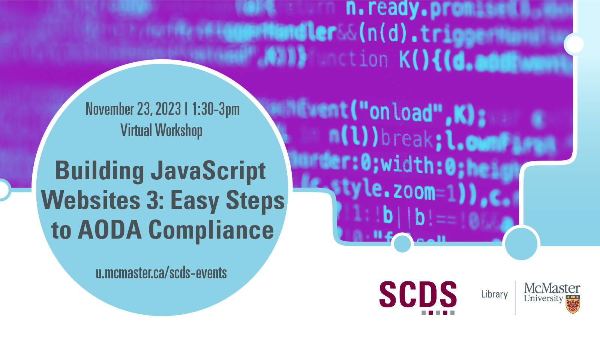

# Building JavaScript Websites 3: Easy Steps to AODA Compliance

December 3 is International Day for Persons with Disabilities! Are you building your own web site using JavaScript and frameworks? In this third workshop of the Building JavaScript Websites series, learn to adapt UI controls in a JavaScript web site to be accessible. 

Starting from a simple prepared single-page application, we will walk you through how easy it is to make a JavaScript web site to be AODA compliant. Each workshop in this series can be taken independently of the other workshops in the series.

**The materials for this workshop are available here:** <https://mcmasterrs.github.io/ws_web-design-guide/>